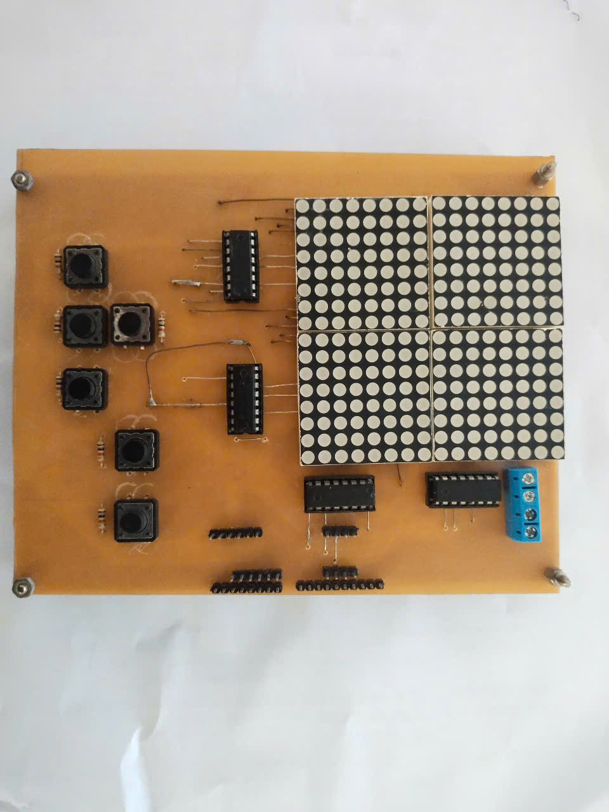

# MATRIX LED GAME 🎮

This project is a **custom-built** gaming device featuring **classic arcade games** like **Snake** and **Airplane Shooting**, displayed on an **LED matrix** and controlled via **physical buttons**. The entire hardware, including the LED display and control system, is designed and assembled from scratch.

## 🔥 Games Included

### 🐍 Snake
- Control the snake using buttons to eat food and grow longer.
- Avoid crashing into the walls or yourself.
- The game speeds up over time for added challenge.

### ✈️ Airplane Shooting
- Pilot a fighter jet and shoot down incoming enemies.
- Dodge enemy bullets and survive as long as possible.
- Earn points by destroying enemies.

## ⚙️ Features
- ✅ **Fully custom-built hardware** (LED matrix, control buttons, and more)
- ✅ **Button-based controls** for precise movement
- ✅ **Optimized animations & smooth gameplay**
- ✅ **Expandable for more games & features**

## 🔧 Hardware Requirements
- LED matrix (e.g., 8x8, 16x16)
- Microcontroller (ESP32, Arduino, etc.)
- Push buttons for controls
- Power supply & wiring

## 📷 Images & Video Demo
🔹 Top View of the Device:

## 🚀 Getting Started
1. Assemble the LED matrix and connect it to the microcontroller.
2. Upload the game firmware using Arduino IDE or PlatformIO.
3. Power up the device and start playing!

Stay tuned for updates as we refine the design and add new features! 🚀
